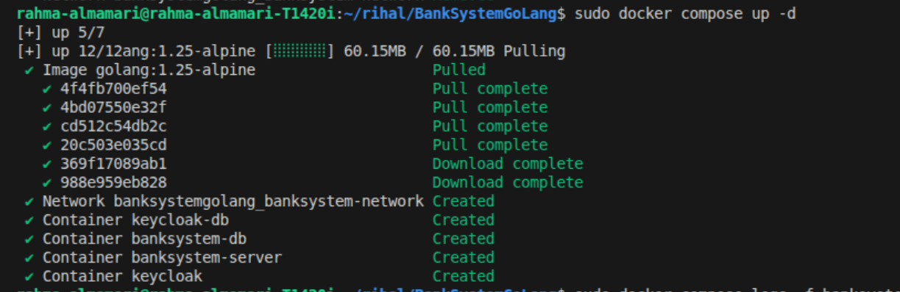
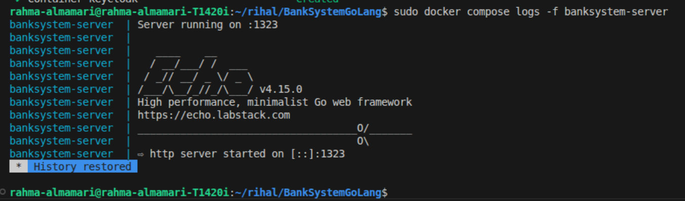
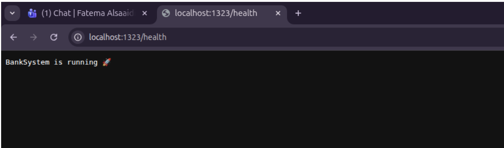
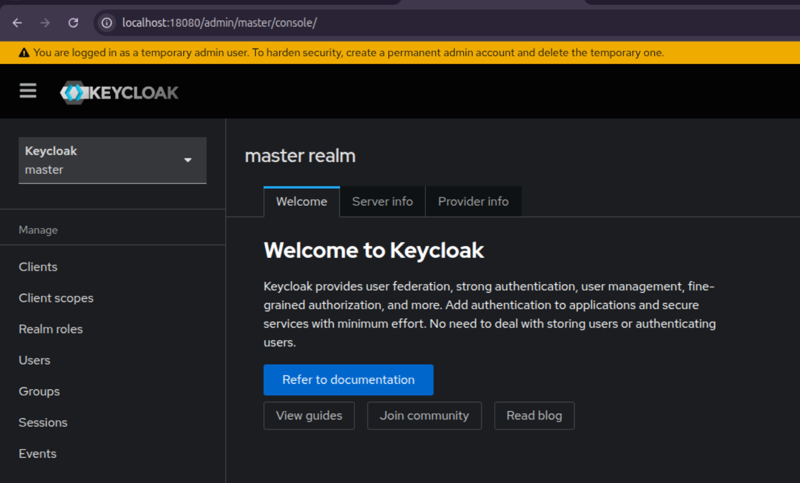

# BankSystemGoLang

## 🛠️ Tech Stack

This project is built using the following technologies:

1. **Go (Echo Framework)** – Backend API development
2. **Cobra** – CLI command management
3. **PostgreSQL** – Relational database
4. **Goose** – Database migrations
5. **SQLC** – Type-safe SQL query generation
6. **Keycloak** – Authentication and authorization
7. **MinIO** – Object storage


## 📁 Project Structure 

This project follows a clean, modular, and scalable architecture, inspired by real-world backend systems.
The goal is to keep responsibilities clearly separated and make the system easy to extend, test, and maintain.

```pgsql
BANKSYSTEMGOLANG/
├── keycloak/
├── proxy/
├── server/
│   ├── cmd/
│   ├── config/
│   ├── db/
│   ├── handlers/
│   ├── images/
│   ├── keycloak/
│   ├── logger/
│   ├── middleware/
│   ├── minio/
│   ├── route/
│   ├── services/
│   └── types/
└── README.md

```

## 🧱 Architectural Flow

```pgsql
Request
  ↓
Route
  ↓
Handler
  ↓
Service
  ↓
Database (SQLC / PostgreSQL)
```

## 📦 Folder Responsibilities

🔹 **Root Level**

- **keycloak/**

  - Contains Keycloak-related configuration (realms, clients, roles).
  - Used for authentication and authorization.

- **proxy/**

  - Holds reverse proxy or gateway-related configurations (e.g., Nginx).
  - Used to route traffic between services securely.

- **README.md**

  - Project documentation.
  - Explains architecture, setup steps, and usage instructions.

- **server/ (Main Backend Application)**

_This folder contains the entire Go backend application as the following:_

  - **🧩 cmd/**

    - Entry point of the application.
    - Uses Cobra CLI to start the server and run commands.
    - Example responsibilities:

      - Start HTTP server
      - Run migrations
      - Seed database

 - **⚙️ config/**

   - Handles application configuration.
   - Loads environment variables (database, server, external services).
   - Keeps configuration logic centralized.

 - **🗄️ db/**

   - Database layer (Database-First approach).  
   - Includes:

     - Migrations (schema evolution)
     - SQL queries
     - Database initialization
     - Seed data

 - **🧠 services/**

     - Contains business logic.
     - Acts as the core of the system.
     - Coordinates:

         - Database operations
         - Validations
         - Transactions
         - Does not depend on HTTP or Echo.

 - **🌐 handlers/**

     - HTTP request handlers (Echo).
     - Responsibilities:

         - Parse request data
         - Validate input
         - Call services
         - Return HTTP responses

 - **🛣️ route/**

     - Defines API routes and endpoints.
     - Connects routes to handlers.
     - Groups endpoints logically (e.g. accounts, users, transactions).

 - **🧱 middleware/**

     - Custom middleware for the application.
     - Examples:

         - Logging
         - Authentication
         - Authorization
         - Request validation 
         - Error handling

 - **🪵 logger/**

     - Centralized logging setup.
     - Uses structured logging (Zap).
     - Shared across all layers (DB, services, handlers).

 - **🔐 keycloak/ (inside server)**

     - Keycloak integration logic.
     - Token validation, role extraction, and auth helpers.

 - **🗂️ types/**

     - Shared types and DTOs.
     - Used to avoid duplication between layers.
     - Keeps models consistent across the project.

 - **🖼️ images/**

     - Stores static images or assets used in documentation or responses.

 - **☁️ minio/**

     - MinIO integration layer.
     - Handles file/object storage logic.
     - Keeps storage concerns isolated from business logic.

## 🏗️ Practical steps for project implementation

### 1. Initialize Go module and main libraries

**Step 1)** Inside `BankSystem/server`:
```bash
go mod init BankSystemGoLang
```


~~NOTE:~~ 

**1. Why do we run go mod init when starting a new Go project?**

Because Go needs to know what your project is and how to manage its dependencies.

**2. What is go mod init actually doing?**

When we run: `go mod init OurProjectName` Go creates a file called: `go.mod` This file is the identity card of our Go project.

**3. What is go.mod?**

`go.mod` tells Go:

1. What is the name of this project (module name)
2. Which external libraries (dependencies) it uses
3. Which versions of those libraries are allowed

**Step 2)** Install the main libs:
```bash
go get github.com/labstack/echo/v4
go get github.com/spf13/cobra
go get go.uber.org/zap
go get github.com/jackc/pgx/v5
go get github.com/jackc/pgx/v5/pgxpool
```


~~NOTE:~~

**1️⃣ Why do we need Echo? `github.com/labstack/echo/v4`**

Echo is a web framework used to build HTTP APIs in Go.

_Problem without Echo_

If you use only the Go standard library:

- You must manually handle:
     - Routing
     - Middleware
     - JSON binding
     - Error handling
- Code becomes repetitive and hard to maintain

_What Echo gives us_

- Fast HTTP routing
- Middleware support
- Clean request/response handling
- Built-in JSON binding and validation

**2️⃣ Why do we need Cobra? `github.com/spf13/cobra`**

Cobra is a CLI framework for Go applications.

_Problem without Cobra_

- You have only one main() entry
- Hard to:

     - Run migrations
     - Run seeds
     - Start server with flags

- Logic becomes messy

_What Cobra gives us_

- Structured CLI commands
- Subcommands (server, migrate, seed)
- Flags (`--env`, `--port`, `--dry-run`)

**3️⃣ Why do we need Zap? `go.uber.org/zap`**

Zap is a structured, high-performance logger.

_Problem with fmt.Println_

- No log levels
- No structured data
- Hard to search logs
- Bad for production

_What Zap gives us_

- Log levels (info, warn, error)
- Structured logs (JSON)
- High performance
- Production-ready logging

**4️⃣ Why do we need pgx? `github.com/jackc/pgx/v5`**

pgx is a PostgreSQL driver for Go.

_Problem with database/sql_

- Slower
- Less PostgreSQL features
- More boilerplate
- Harder type handling

_What pgx gives us_

- Native PostgreSQL support
- Better performance
- Better handling of arrays, JSON, UUIDs
- Works perfectly with SQLC

**5️⃣ Why do we need pgxpool? `github.com/jackc/pgx/v5/pgxpool`**

pgxpool manages database connections.

_Problem without connection pooling_

- New DB connection per request
- Slow performance
- Connection exhaustion
- DB crashes under load

_What pgxpool gives us_

- Reuses connections
- Limits open connections
- Improves performance
- Safe concurrent access

**🧠 Big Picture (Very Important)**

| Library | Responsibility        |
| ------- | --------------------- |
| Echo    | HTTP server & routing |
| Cobra   | CLI & commands        |
| Zap     | Logging               |
| pgx     | PostgreSQL driver     |
| pgxpool | DB connection pooling |

**🏗️ How they work together**

```scss
CLI (Cobra)
   ↓
Server start
   ↓
Logger (Zap)
   ↓
DB Pool (pgxpool)
   ↓
Echo Router(Echo)
   ↓
Handlers
   ↓
Services
   ↓
SQLC (pgx)
   ↓
PostgreSQL
```

### 2. Add Docker Compose (Infrastructure Setup)

This project uses **Docker Compose** to run all required infrastructure services in a local development environment.

The goal is to simulate a production-like setup while keeping development simple and consistent.

#### 1. Included Services
 
 The following containers are configured:
 - BankSystem Backend

    - Go (Echo Framework)
    - Runs the API server

 - PostgreSQL (BankSystem DB)

    - Dedicated database for the backend

 - Keycloak

    - Authentication and authorization server

 - PostgreSQL (Keycloak DB)

    - Dedicated database for Keycloak

 - Docker Network

    - Isolated internal network for service communication

 - Docker Volumes

    - Persistent storage for databases

~~NOTE:~~ ⚠️ _MinIO is intentionally not included yet and will be added in a later phase._

#### 2. Docker Compose Architecture
```scss
banksystem-network
│
├── banksystem-server
│     └── (Go + Echo API)
│
├── banksystem-db
│     ├── (PostgreSQL for BankSystem)
│     └── banksystem-db-data (volume)
│
├── keycloak
│     └── (Authentication Server)
│
└── keycloak-db
      ├── (PostgreSQL for Keycloak)
      └── keycloak-db-data (volume)
```

#### 3. Ports Mapping

| Service        | Host Port | Container Port |
| -------------- | --------- | -------------- |
| BankSystem API | `1323`    | `1323`         |
| BankSystem DB  | `55432`   | `5432`         |
| Keycloak       | `18080`   | `8080`         |

#### 4. Docker Compose File

Create a `docker-compose.yml` file at the project root:

```yaml
networks:
  banksystem-network:

volumes:
  banksystem-db-data:
  keycloak-db-data:

services:

  banksystem-db:
    image: postgres:17.5-alpine
    container_name: banksystem-db
    restart: always
    environment:
      POSTGRES_DB: banksystem
      POSTGRES_USER: banksystem
      POSTGRES_PASSWORD: banksystem
    volumes:
      - banksystem-db-data:/var/lib/postgresql/data
    ports:
      - "55432:5432"

    networks:
      - banksystem-network

  keycloak-db:
    image: postgres:17.5-alpine
    container_name: keycloak-db
    restart: always
    environment:
      POSTGRES_DB: keycloak
      POSTGRES_USER: keycloak
      POSTGRES_PASSWORD: keycloak
    volumes:
      - keycloak-db-data:/var/lib/postgresql/data
    networks:
      - banksystem-network

  keycloak:
    image: quay.io/keycloak/keycloak:26.0.5
    container_name: keycloak
    command: start-dev
    restart: always
    depends_on:
      - keycloak-db
    environment:
      KC_DB: postgres
      KC_DB_URL_HOST: keycloak-db
      KC_DB_URL_DATABASE: keycloak
      KC_DB_USERNAME: keycloak
      KC_DB_PASSWORD: keycloak
      KEYCLOAK_ADMIN: admin
      KEYCLOAK_ADMIN_PASSWORD: admin
    ports:
       - "18080:8080"

    networks:
      - banksystem-network

  banksystem-server:
    image: golang:1.25-alpine
    container_name: banksystem-server
    working_dir: /app
    volumes:
      - ./server:/app
    command: sh -c "go mod download && go run ."
    depends_on:
      - banksystem-db
    ports:
      - "1323:1323"
    networks:
      - banksystem-network
```

**Docker Compose File – Line by Line Explanation**

**1️⃣ Networks**

```yaml
networks:
  banksystem-network:
```
- **What this does:**
    - Creates a custom Docker bridge network
    - All containers attached to this network:

      -  Can communicate with each other using service names
      - Are isolated from other Docker projects
- **Why we need it:**
    - banksystem-server can connect to banksystem-db
    - keycloak can connect to keycloak-db
    - No other port is needed for internal communication

**2️⃣ Volumes**

```yaml
volumes:
  banksystem-db-data:
  keycloak-db-data:
```

**What this does:**

- Defines named volumes managed by Docker
- Used to save database data

**Why we need it:**

- Without volumes:

    - Database data is lost when containers stop or restart

- With volumes:

    - Data survives container restarts
    - Simulates real production storage

**3️⃣ Services**

Everything under `services:` defines a **container**.

**1. 🐘 banksystem-db (PostgreSQL for BankSystem)**

```yaml
banksystem-db:
```

**Service name:**

- Used as hostname inside Docker network
- Other services connect using banksystem-db

```yaml
image: postgres:17.5-alpine
```

**service image**

- Uses official PostgreSQL image from docker hup
- `alpine` → is a type of the image, based on Alpine Linux 
and it mean **“Run this software on top of Alpine Linux instead of a full Linux OS.”** and it is smaller, faster, production-friendly.

```yaml
container_name: banksystem-db
```

**service container name**

- Explicit container name
- Makes debugging easier (docker logs banksystem-db)

```yaml
restart: always
```

**service status**

- Container restarts automatically if it crashes
- Important for long-running services like databases

```yaml
environment:
  POSTGRES_DB: banksystem
  POSTGRES_USER: banksystem
  POSTGRES_PASSWORD: banksystem
```
**service enviroment variables**

- Initializes PostgreSQL:

    - Creates database: banksystem
    - Creates user: banksystem
    - Sets password

```yaml
volumes:
  - banksystem-db-data:/var/lib/postgresql/data
```

**service volume**

- Mounts Docker volume into PostgreSQL data directory
- Ensures persistent database storage

```yaml
ports:
  - "55432:5432"
```

**service ports**

- Maps container port 5432 → host port 55432
- Allows connecting from host (psql, tools, migrations)

```yaml
networks:
  - banksystem-network
```

**service network**

- Attaches database container to the shared network

**2. 🐘 keycloak-db (PostgreSQL for Keycloak)**

```yaml
keycloak-db:
```

**Service name:**

- Separate database for Keycloak
- Never share DBs between services

```yaml
image: postgres:17.5-alpine
container_name: keycloak-db
restart: always
```

- Same reasons as BankSystem DB

```yaml
environment:
  POSTGRES_DB: keycloak
  POSTGRES_USER: keycloak
  POSTGRES_PASSWORD: keycloak
```

- Dedicated database credentials for Keycloak

```yaml
volumes:
  - keycloak-db-data:/var/lib/postgresql/data
```

- Persistent storage for Keycloak data

```yaml
networks:
  - banksystem-network
```

- Allows Keycloak to reach its database

**3. 🔐 keycloak (Authentication Server)**

```yaml
keycloak:
```

**service name**

- Authentication and authorization service

```yaml
image: quay.io/keycloak/keycloak:26.0.5
```

**service image**

- Official Keycloak image
- Specific version for stability

```yaml
container_name: keycloak
```

**srevice container name**

- Easier debugging and log access

```yaml
command: start-dev
```

**service run command**

- Runs Keycloak in development mode
- No HTTPS required
- Faster startup

```yaml
restart: always
```

**service status**

- Keeps Keycloak running automatically

```yaml
depends_on:
  - keycloak-db
```

**service dependence**

- Ensures database container starts first
- Prevents startup failures

```yaml
environment:
  KC_DB: postgres
  KC_DB_URL_HOST: keycloak-db
  KC_DB_URL_DATABASE: keycloak
  KC_DB_USERNAME: keycloak
  KC_DB_PASSWORD: keycloak
  KEYCLOAK_ADMIN: admin
  KEYCLOAK_ADMIN_PASSWORD: admin
```

**service enviroment variables**

- Configures Keycloak database connection
- Uses service name `keycloak-db` as hostname
- Creates initial Keycloak admin user
- Used for first login

```yaml
ports:
  - "18080:8080"
```

**service ports**

- Maps Keycloak UI:

   - Container `8080`
   - Host `18080`

- Avoids conflict with other Keycloak instances

```yaml
networks:
  - banksystem-network
```

- Allows communication with DB and backend

**4. 🚀 banksystem-server (Go Backend)**

```yaml
banksystem-server:
```

**service name**

- Backend API service

```yaml
image: golang:1.25-alpine
```

**service image**

- Go version matches `go.mod`
- Prevents version mismatch errors

```yaml
container_name: banksystem-server
```

**servicd container name**

- Easier container management

```yaml
working_dir: /app
```

**service working directory**

- Sets working directory inside container

```yaml
volumes:
  - ./server:/app
```

**service volume**

- Mounts local source code into container
- Enables live development without rebuilding image

```yaml
command: sh -c "go mod download && go run ."
```

**service run command**

- Downloads dependencies
- Runs the Go application
- Uses module root (.)

```yaml
depends_on:
  - banksystem-db
```

**service dependence**

- Ensures database is running before backend starts

```yaml
ports:
  - "1323:1323"
```

**service ports**

- Exposes API to host
- Echo server listens on port 1323

```yaml
networks:
  - banksystem-network
```

**service network**

- Enables backend ↔ DB ↔ Keycloak communication

#### 5. main.go File

Create minimal `main.go` **so container can run** in server folder root

```go
package main

import (
	"fmt"

	"github.com/labstack/echo/v4"
)

func main() {
	e := echo.New()

	e.GET("/health", func(c echo.Context) error {
		return c.String(200, "BankSystem is running 🚀")
	})

	fmt.Println("Server running on :1323")
	e.Logger.Fatal(e.Start(":1323"))
}
```

**main.go File – Line by Line Explanation**

**1. `package main`**

```go
package main
```

- **What this does:**

   - Every Go file belongs to a package
   - `main` is **special**
   - A program without `package main` can not be executed
   - Go looks for a `main()` function in this package to start the program so it is the entry ponit to the program

**2. `import (...)`**

```go
import (
	"fmt"

	"github.com/labstack/echo/v4"
)
```

- **What this does:**
   
   - Imports external and standard libraries

- **Line by line:**

   - `"fmt"` -> Standard Go package, used for formatted I/O (printing to console)
   - `"github.com/labstack/echo/v4"` -> Echo framework, lightweight and fast HTTP framework, used to build REST APIs

**3. `func main() {`**

```go
func main() {}
```

- **What this does:**

   - Entry point of the Go application
   - Execution starts here
   - Similar to `main()` in C / Java

**4. Create Echo instance**

```go
e := echo.New()
```

- **What this does:**

   - Creates a new Echo application instance
   - `e` is the HTTP server
   - Handles:

     - Routing
     - Middleware
     - Request/response lifecycle

**5. Health endpoint**

```go
e.GET("/health", func(c echo.Context) error {})
```

- **What this does:**

   - Registers an HTTP GET endpoint
   - Path: `/health`
   - Used to check if the server is alive

- **Why `/health`?**

   - Standard health-check endpoint
   - Used by:

     - Docker
     - Kubernetes
     - Load balancers
     - Monitoring tools

**6. Request handler**

```go
return c.String(200, "BankSystem is running 🚀")
```

- **What this does:**

   - Sends a plain text response
   - HTTP status code: 200 OK
   - Body: "BankSystem is running 🚀"

- **`c` (echo.Context):**

   - Represents the HTTP request and response
   - Used to:

     - Read params
     - Read headers
     - Send responses

**7. Log server startup**

```go
fmt.Println("Server running on :1323")
```

- **What this does:**

   - Prints message to console
   - Helpful during development
   - Confirms server startup

**8. Start the server**

```go
e.Logger.Fatal(e.Start(":1323"))
```

- **What this does:**

  - `e.Start(":1323")` -> Starts HTTP server, listens on port 1323, blocks execution until server stops
  - `e.Logger.Fatal(...)` :
     - If server fails to start:
       - Logs the error
       - Terminates the application
     - Example errors:
       - Port already in use
       - Permission denied

#### 6. Run Everything

**1. From project root run**

```bash
sudo docker compose up -d
```


**💡 Professional Workflow**

| Stage                  | Command                                    |
| ---------------------- | ------------------------------------------ |
| First time / debugging | `docker compose up`                        |
| Daily development      | `docker compose up -d`                     |
| Stop everything        | `docker compose down`                      |
| Restart one service    | `docker compose restart banksystem-server` |
| See logs               | `docker compose logs -f keycloak`          |

**2. Test backend server is running**

```bash
sudo docker compose logs -f banksystem-server
```





**3. Test keycloak is running**

~~NOTE:~~ Keycloak login -> user: admin | pass: admin

