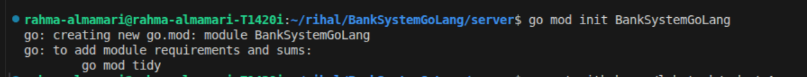
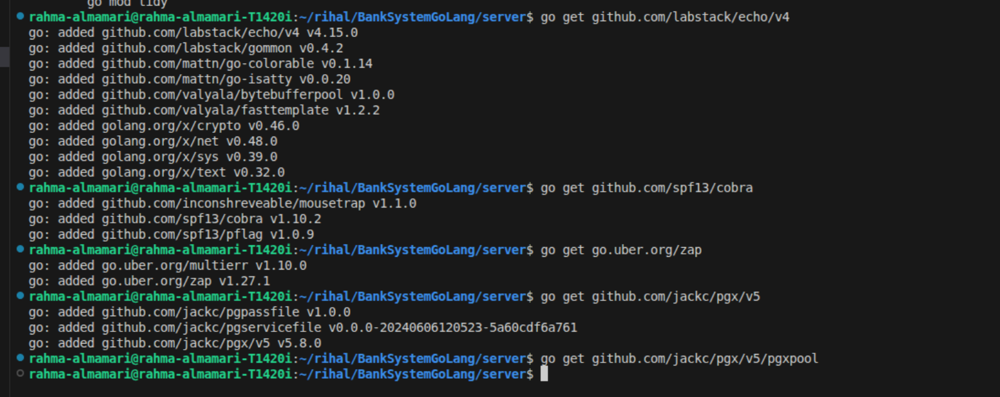

# BankSystemGoLang

## 🛠️ Tech Stack

This project is built using the following technologies:

1. **Go (Echo Framework)** – Backend API development
2. **Cobra** – CLI command management
3. **PostgreSQL** – Relational database
4. **Goose** – Database migrations
5. **SQLC** – Type-safe SQL query generation
6. **Keycloak** – Authentication and authorization
7. **MinIO** – Object storage


## 📁 Project Structure 

This project follows a clean, modular, and scalable architecture, inspired by real-world backend systems.
The goal is to keep responsibilities clearly separated and make the system easy to extend, test, and maintain.

```pgsql
BANKSYSTEMGOLANG/
├── keycloak/
├── proxy/
├── server/
│   ├── cmd/
│   ├── config/
│   ├── db/
│   ├── handlers/
│   ├── images/
│   ├── keycloak/
│   ├── logger/
│   ├── middleware/
│   ├── minio/
│   ├── route/
│   ├── services/
│   └── types/
└── README.md

```

## 🧱 Architectural Flow

```pgsql
Request
  ↓
Route
  ↓
Handler
  ↓
Service
  ↓
Database (SQLC / PostgreSQL)
```

## 📦 Folder Responsibilities

🔹 **Root Level**

- **keycloak/**

  - Contains Keycloak-related configuration (realms, clients, roles).
  - Used for authentication and authorization.

- **proxy/**

  - Holds reverse proxy or gateway-related configurations (e.g., Nginx).
  - Used to route traffic between services securely.

- **README.md**

  - Project documentation.
  - Explains architecture, setup steps, and usage instructions.

- **server/ (Main Backend Application)**

_This folder contains the entire Go backend application as the following:_

  - **🧩 cmd/**

    - Entry point of the application.
    - Uses Cobra CLI to start the server and run commands.
    - Example responsibilities:

      - Start HTTP server
      - Run migrations
      - Seed database

 - **⚙️ config/**

   - Handles application configuration.
   - Loads environment variables (database, server, external services).
   - Keeps configuration logic centralized.

 - **🗄️ db/**

   - Database layer (Database-First approach).  
   - Includes:

     - Migrations (schema evolution)
     - SQL queries
     - Database initialization
     - Seed data

 - **🧠 services/**

     - Contains business logic.
     - Acts as the core of the system.
     - Coordinates:

         - Database operations
         - Validations
         - Transactions
         - Does not depend on HTTP or Echo.

 - **🌐 handlers/**

     - HTTP request handlers (Echo).
     - Responsibilities:

         - Parse request data
         - Validate input
         - Call services
         - Return HTTP responses

 - **🛣️ route/**

     - Defines API routes and endpoints.
     - Connects routes to handlers.
     - Groups endpoints logically (e.g. accounts, users, transactions).

 - **🧱 middleware/**

     - Custom middleware for the application.
     - Examples:

         - Logging
         - Authentication
         - Authorization
         - Request validation 
         - Error handling

 - **🪵 logger/**

     - Centralized logging setup.
     - Uses structured logging (Zap).
     - Shared across all layers (DB, services, handlers).

 - **🔐 keycloak/ (inside server)**

     - Keycloak integration logic.
     - Token validation, role extraction, and auth helpers.

 - **🗂️ types/**

     - Shared types and DTOs.
     - Used to avoid duplication between layers.
     - Keeps models consistent across the project.

 - **🖼️ images/**

     - Stores static images or assets used in documentation or responses.

 - **☁️ minio/**

     - MinIO integration layer.
     - Handles file/object storage logic.
     - Keeps storage concerns isolated from business logic.

## 🏗️ Practical steps for project implementation

### 1. Initialize Go module and main libraries

**Step 1)** Inside `BankSystem/server`:
```bash
go mod init BankSystemGoLang
```



~~NOTE:~~ 

**1. Why do we run go mod init when starting a new Go project?**

Because Go needs to know what your project is and how to manage its dependencies.

**2. What is go mod init actually doing?**

When we run: `go mod init OurProjectName` Go creates a file called: `go.mod` This file is the identity card of our Go project.

**3. What is go.mod?**

`go.mod` tells Go:

1. What is the name of this project (module name)
2. Which external libraries (dependencies) it uses
3. Which versions of those libraries are allowed

**Step 2)** Install the main libs:
```bash
go get github.com/labstack/echo/v4
go get github.com/spf13/cobra
go get go.uber.org/zap
go get github.com/jackc/pgx/v5
go get github.com/jackc/pgx/v5/pgxpool
```



~~NOTE:~~

**1️⃣ Why do we need Echo? `github.com/labstack/echo/v4`**

Echo is a web framework used to build HTTP APIs in Go.

_Problem without Echo_

If you use only the Go standard library:

- You must manually handle:
     - Routing
     - Middleware
     - JSON binding
     - Error handling
- Code becomes repetitive and hard to maintain

_What Echo gives us_

- Fast HTTP routing
- Middleware support
- Clean request/response handling
- Built-in JSON binding and validation

**2️⃣ Why do we need Cobra? `github.com/spf13/cobra`**

Cobra is a CLI framework for Go applications.

_Problem without Cobra_

- You have only one main() entry
- Hard to:

     - Run migrations
     - Run seeds
     - Start server with flags

- Logic becomes messy

_What Cobra gives us_

- Structured CLI commands
- Subcommands (server, migrate, seed)
- Flags (`--env`, `--port`, `--dry-run`)

**3️⃣ Why do we need Zap? `go.uber.org/zap`**

Zap is a structured, high-performance logger.

_Problem with fmt.Println_

- No log levels
- No structured data
- Hard to search logs
- Bad for production

_What Zap gives us_

- Log levels (info, warn, error)
- Structured logs (JSON)
- High performance
- Production-ready logging

**4️⃣ Why do we need pgx? `github.com/jackc/pgx/v5`**

pgx is a PostgreSQL driver for Go.

_Problem with database/sql_

- Slower
- Less PostgreSQL features
- More boilerplate
- Harder type handling

_What pgx gives us_

- Native PostgreSQL support
- Better performance
- Better handling of arrays, JSON, UUIDs
- Works perfectly with SQLC

**5️⃣ Why do we need pgxpool? `github.com/jackc/pgx/v5/pgxpool`**

pgxpool manages database connections.

_Problem without connection pooling_

- New DB connection per request
- Slow performance
- Connection exhaustion
- DB crashes under load

_What pgxpool gives us_

- Reuses connections
- Limits open connections
- Improves performance
- Safe concurrent access

**🧠 Big Picture (Very Important)**

| Library | Responsibility        |
| ------- | --------------------- |
| Echo    | HTTP server & routing |
| Cobra   | CLI & commands        |
| Zap     | Logging               |
| pgx     | PostgreSQL driver     |
| pgxpool | DB connection pooling |

**🏗️ How they work together**

```scss
CLI (Cobra)
   ↓
Server start
   ↓
Logger (Zap)
   ↓
DB Pool (pgxpool)
   ↓
Echo Router(Echo)
   ↓
Handlers
   ↓
Services
   ↓
SQLC (pgx)
   ↓
PostgreSQL
```

### 2. Add a local PostgreSQL with Docker Compose

Create: `BankSystemGoLang/docker-compose.yml` (outside `server`, in root `BankSystemGoLang`):